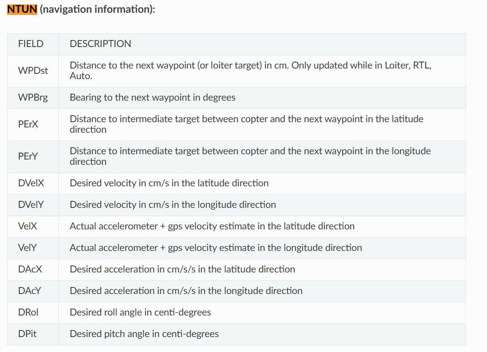
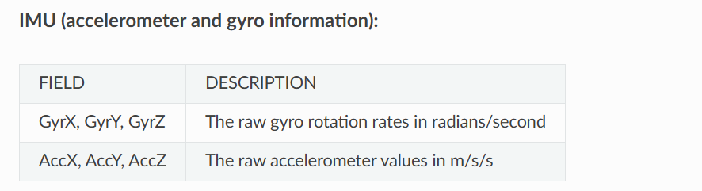
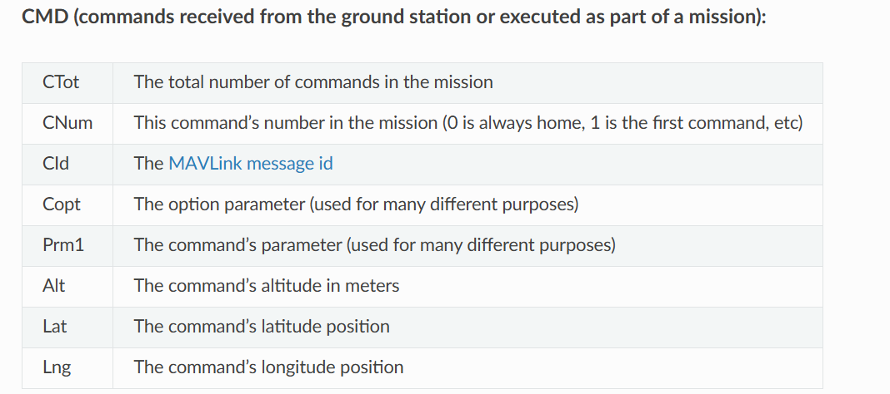
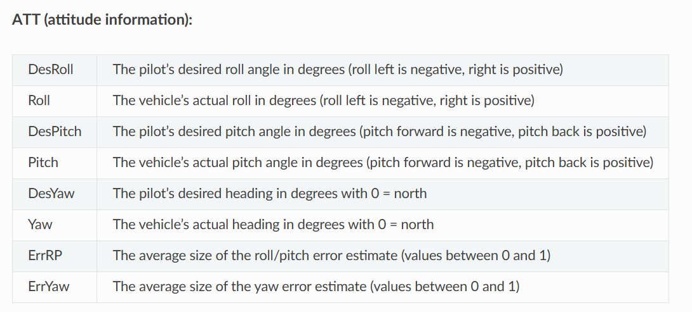
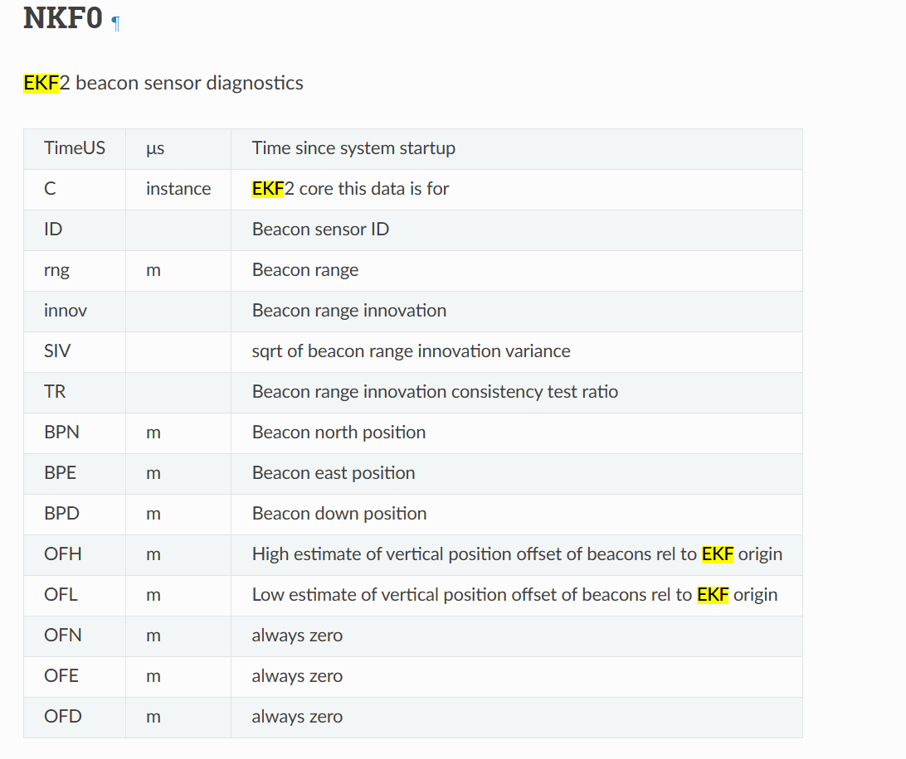
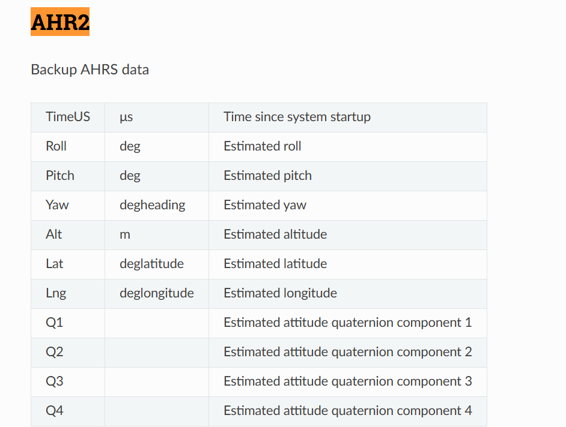

# Collecting data from Ardupilot SITL 
- When running simulation data with Ardupilot, the .bin files will be saved where you installed ardupilot in a directory that looks like this
```
/home/justin/ardupilot/ArduPlane/logs
```

# Initial virtual env setup
If this is your first time setting up the python env do the following command
```
python -m venv venv 
```

Then start up your environment by doing the following command
```
source run_venv.sh #starts the virtual environment
```

Now install all the packages you need
```
pip install -r requirements.txt
```
From now on make sure to start up the virtual environment before you do anything

## Running the parser

### 1) Activate the virtual environment
```bash
source run_venv.sh
```

### 2) Run the parser script

The project includes a CLI script (`generate_json.py`) that wraps the `FlightParser` utilities.

---

### A) Parse a single BIN log → one JSON file
```bash
python generate_json.py --log /path/to/log.BIN --out data/json_out/log_export.json
```

Example:
```bash
python generate_json.py   --log /home/justin/ardupilot/ArduPlane/logs/00000001.BIN   --out data/json_out/00000001.json
```

---

### B) Parse a single BIN log → split into time slices
Use `--slice_seconds` to write **one JSON file per time window** (e.g., 60 seconds per file):

```bash
python generate_json.py   --log /path/to/log.BIN   --out data/json_out/log.json   --slice_seconds 60
```

Output files will look like:

```
data/json_out/log_part000.json
data/json_out/log_part001.json
data/json_out/log_part002.json
...
```

---

### C) Batch mode: parse many BIN logs using a glob 

```bash
python generate_json.py   --glob "/home/repo/ardupilot/ArduPlane/logs/**/*.BIN"   --out_dir data/json_out   --workers 8
```

---

### D) Batch mode + time slicing (recommended for large logs)
```bash
python generate_json.py   --glob "/home/repo/ardupilot/ArduPlane/logs/**/*.BIN"   --out_dir data/json_out   --workers 8   --slice_seconds 60
```

---

## CLI options

- `--log <path>`  
  Parse a single `.BIN` log file

- `--out <path>`  
  Output JSON path (required when using `--log`)

- `--glob "<pattern>"`  
  Parse multiple logs using a glob pattern

- `--out_dir <dir>`  
  Output directory for batch mode

- `--dt <seconds>`  
  Output sampling period (default: `0.05` → 20 Hz)

- `--slice_seconds <seconds>`  
  Split output into multiple JSON files (default: `60` → 60s)

- `--workers <N>`  
  Number of worker processes for batch mode (default: `8`)

- `--strict_nkf`  
  Error if EKF position (`PN/PE/PD`) is missing

- `--verbose`  
  Print message types present per log

Example with a different sample rate:

```bash
# Export at 10 Hz
python generate_json.py   --log /path/to/log.BIN   --out data/json_out/log.json   --dt 0.1
```

---

## Output format

Each JSON file contains a uniformly-sampled time series including:

- EKF position (NED): `pn_m`, `pe_m`, `pd_m`
- Attitude: `phi_rad`, `theta_rad`, `psi_rad`
- NED velocity: `vx`, `vy`, `vz`
- Body-frame velocity (FRD): `u_ms`, `v_ms`, `w_ms`
- Body rates: `p_radps`, `q_radps`, `r_radps`
- Commanded attitude setpoints
- Throttle command

These outputs are suitable for machine learning, system identification, and post-flight analysis.

---

# Useful flight log message details
Refer to this link to get more information about the message details 

https://ardupilot.org/plane/docs/common-downloading-and-analyzing-data-logs-in-mission-planner.html

https://ardupilot.org/plane/docs/logmessages.html

Here are some useful ones you can use, can look at the other ones as well
NTUN 


IMU 


CMD 


ATT


AHR2


NKF
