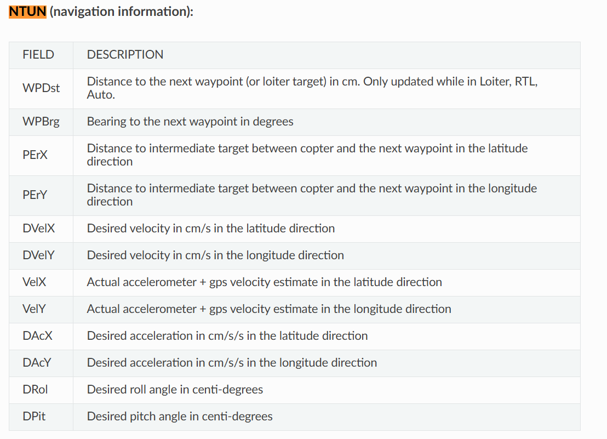
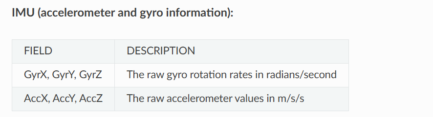
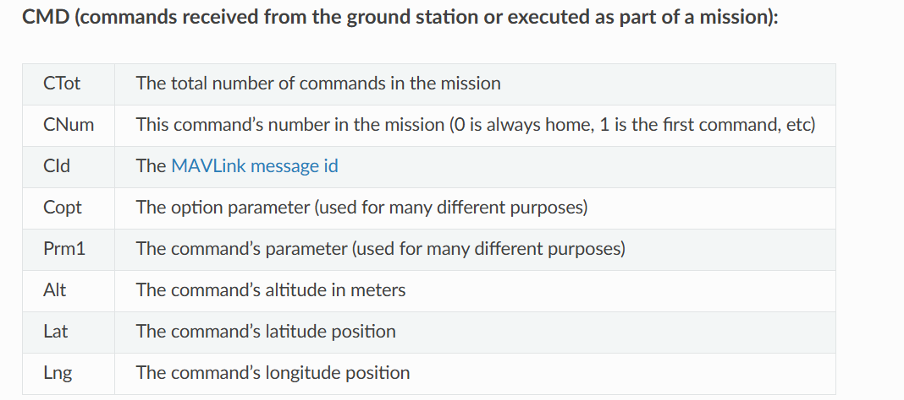
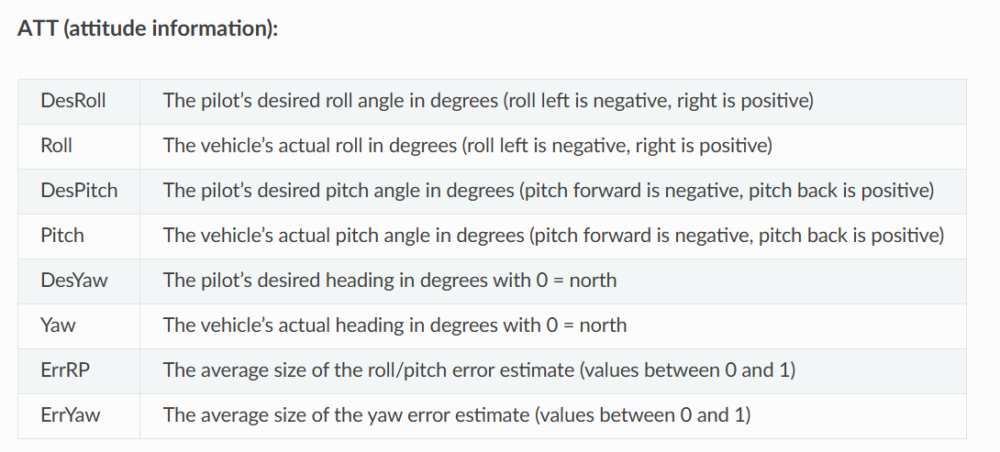
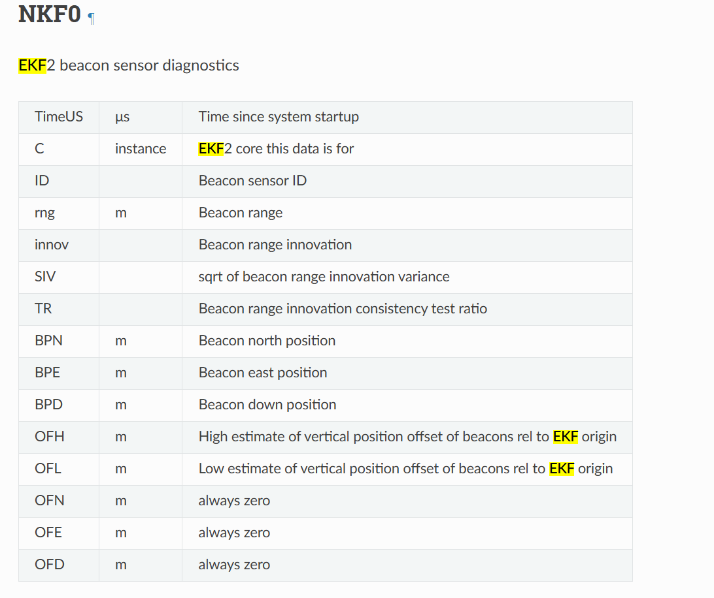
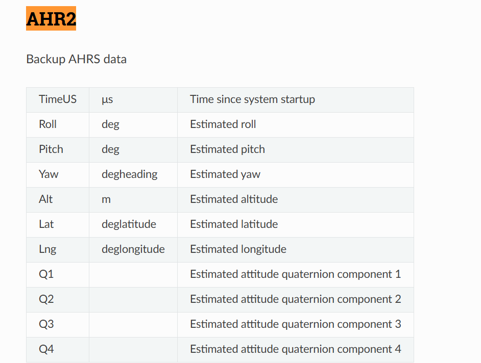

# Collecting data from Ardupilot SITL 
- When running simulation data with Ardupilot, the .bin files will be saved where you installed ardupilot in a directory that looks like this
```
/home/justin/ardupilot/ArduPlane/logs
```

# Initial virtual env setup
If this is your first time setting up the python env do the following command
```
python -m venv venv 
```

Then start up your environment by doing the following command
```
source run_venv.sh #starts the virtual environment
```

Now install all the packages you need
```
pip install -r requirements.txt
```
From now on make sure to start up the virtual environment before you do anything

# Running the parser
```
source run_venv.sh
```
In the FlightParser.py feel free to select any of the binaries from the data/ folder and run the FlightParser.py code
```
python3 FlightParser.py
```

# Useful flight log message details
Refer to this link to get more information about the message details 

https://ardupilot.org/plane/docs/common-downloading-and-analyzing-data-logs-in-mission-planner.html

https://ardupilot.org/plane/docs/logmessages.html

Here are some useful ones you can use, can look at the other ones as well
NTUN 


IMU 


CMD 


ATT


AHR2


NKF
