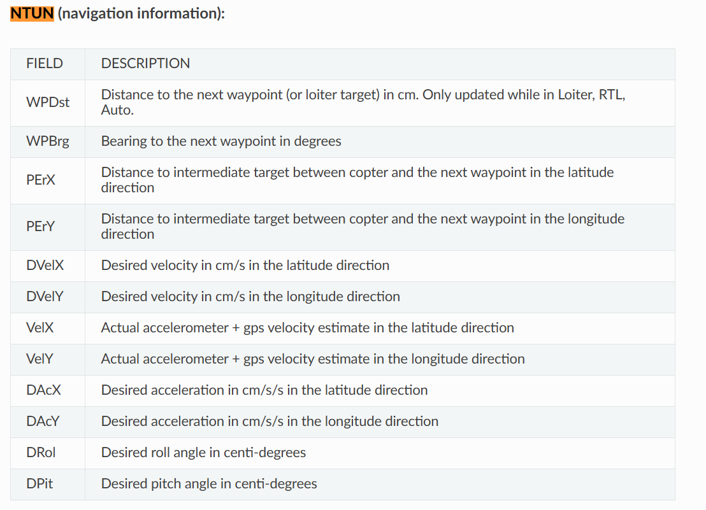
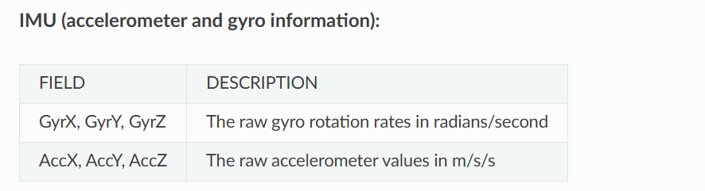
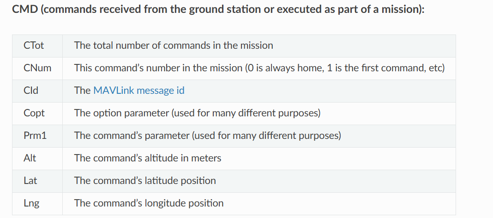
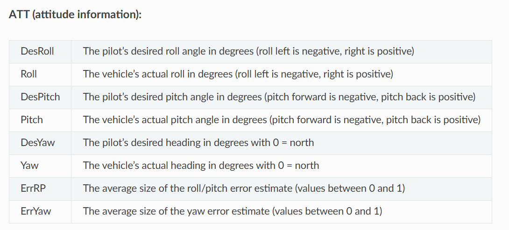
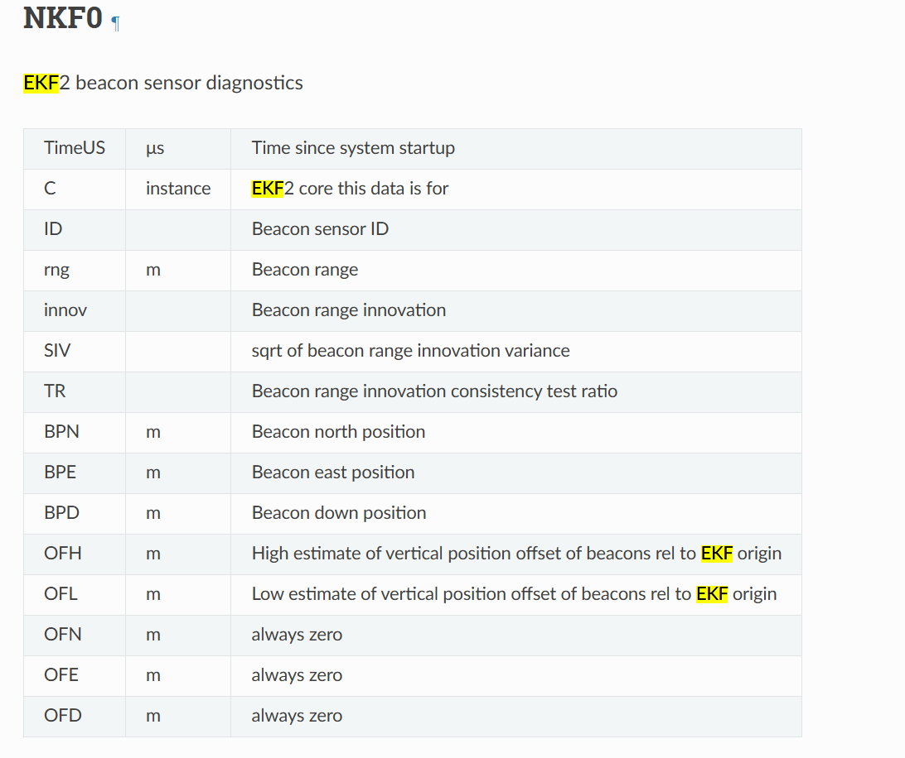
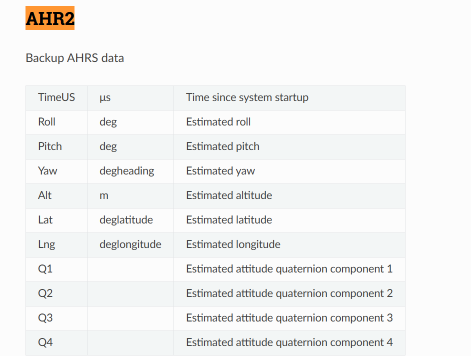

# Collecting data from Ardupilot SITL 
- When running simulation data with Ardupilot, the .bin files will be saved where you installed ardupilot in a directory that looks like this
```
/home/justin/ardupilot/ArduPlane/logs
```

# Useful flight log message details
Refer to this link to get more information about the message details 

https://ardupilot.org/plane/docs/common-downloading-and-analyzing-data-logs-in-mission-planner.html

https://ardupilot.org/plane/docs/logmessages.html

Here are some useful ones you can use, can look at the other ones as well
NTUN 


IMU 


CMD 


ATT


AHR2


NKF
